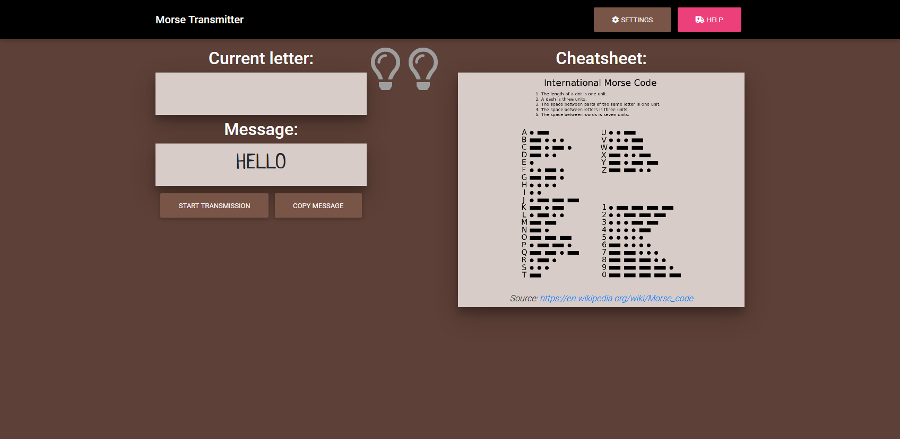

# Morse transmitter
This application helps you to practice transmitting messages with a Morse code signal. You can simulate transmission using SPACEBAR key on your keyboard (touch screens not supported yet) by tapping it with certain frequency and duration. 

## What is a Morse code ?
According to Wikipedia:
>
> *Morse code is a method used in telecommunication to encode text characters as standardized sequences of two different signal durations, called dots and dashes or dits and dahs. Morse code is named after Samuel Morse, an inventor of the telegraph.*
>
Read more [here](https://en.wikipedia.org/wiki/Morse_code) .

## How to run this app ?
Clone this repository to your hard drive with:
#### `git clone https://github.com/kjuraszek/morse-transmitter`

Install dependencies in project directory:
#### `npm install`

Start app in development mode:
#### `npm start`
Open [http://localhost:3000](http://localhost:3000) to view it in the browser.

Running:
#### `npm run build`
builds the app for production to the `build` folder.

## How to use this app ?
To begin click `Start transmission` button. Tap SPACEBAR key with certain durations and breaks (based on `Cheatsheet`) to create letters, words and sentences. To stop transmission click `Stop transmission` button. You can copy created message with `Copy message` button. If you type unrecognizable sequence, it will be printed as `#` sign in your message.

Between Transmitter and Cheatsheet are two Bulbs. The first one indicates in which part you are: a letter (green color), a word (blue color) or a sentence (grey color). The second one indicates produced unit: a dot (green color), a dash (blue color) or none (grey color).

You can change the duration of a single unit in `Settings` area.